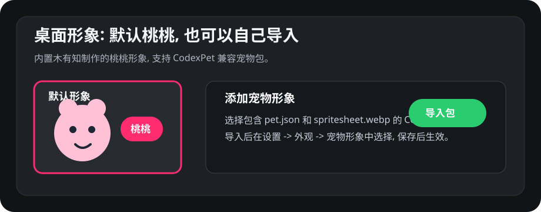
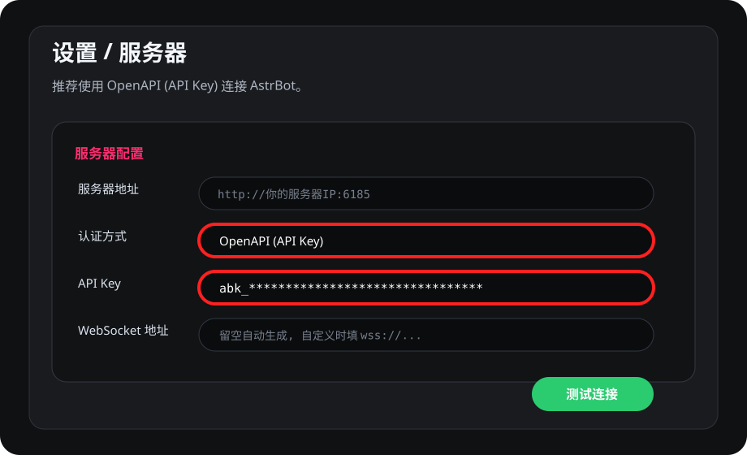
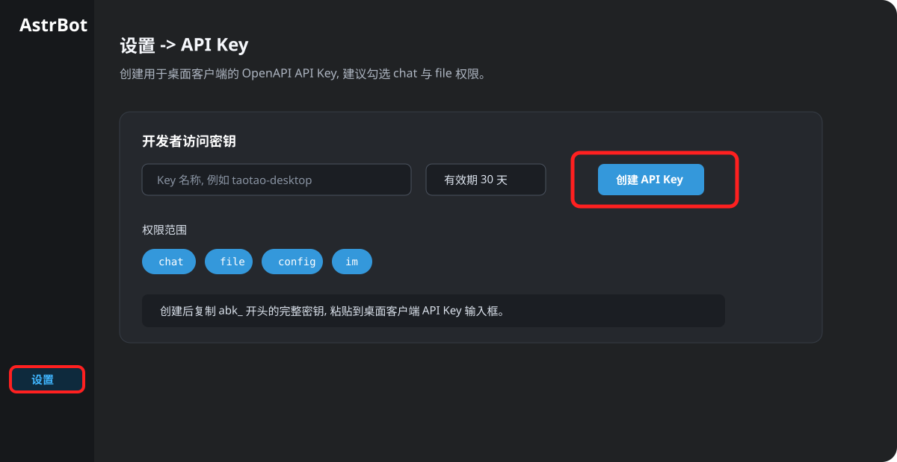

# 🎈 AstrBot 桌面助手插件 —— 让悬浮球陪伴成为可能

<div align="center">

[](https://github.com/Soulter/AstrBot)
[](https://www.python.org/)
[](LICENSE)

**AstrBot 服务端插件，为桌面悬浮球提供 AI 能力支撑**

[⚡ 快速部署](#-快速部署) · [🆕 本次更新](#-本次更新重点) · [✨ 核心功能](#-核心功能) · [🔌 附加能力](#-附加能力qq-远程功能) · [🐳 Docker 部署](#-docker-部署指南)

</div>

---

## 🆕 本次更新重点

### 🐾 桌面客户端新增默认形象：桃桃

新版桌面客户端默认启用 **桃桃** 桌宠形象，这是木有知自己制作的 Q 版桌宠。用户仍然可以切换回传统悬浮球，也可以导入自己的 **CodexPet 兼容宠物包**，实现完全自定义的桌宠形象。

桌宠包需要包含 `pet.json` 和 `spritesheet.webp`。在桌面客户端「设置 → 外观 → 宠物形象 → 添加宠物形象」里导入后，选择对应形象并保存即可。



### 🔐 适配 OpenAPI (API Key) 连接

本插件已同步适配桌面客户端新增的 **OpenAPI (API Key)** 连接模式。客户端不再必须保存 AstrBot 管理员账号密码，可以直接使用 AstrBot 生成的 `abk_` API Key 连接服务端，聊天、图片/截图附件上传和远控 WebSocket 都会走新的认证链路。

在桌面客户端「设置 → 服务器」中选择 `OpenAPI (API Key)`，填入 API Key 后保存即可。WebSocket 地址通常可以留空，客户端会按服务器地址自动生成；使用反向代理或自定义路径时，再填写完整 `ws://` / `wss://` 地址。



### 🗝️ API Key 获取方式

进入 AstrBot 管理面板「设置」，找到「API Key」区域，填写 Key 名称、选择有效期，然后点击「创建 API Key」。建议至少勾选 `chat` 和 `file` 权限：`chat` 用于对话和 WebSocket 远控认证，`file` 用于图片、截图等附件上传。图中也勾选了 `config` 和 `im`，用于保留更多 AstrBot OpenAPI 扩展能力。



### 🔌 为什么插件也必须同步更新？

OpenAPI 模式不是只改客户端就完事。服务端插件需要识别 `abk_` API Key、校验 AstrBot OpenAPI 权限，并允许远控 WebSocket 复用 API Key；同时客户端通过 `/api/v1/file` 上传截图附件时，插件侧也要保持新协议兼容。请将本插件更新到 `v1.1.5` 或更新版本后，再使用桌面客户端的 OpenAPI 模式。

---

## 🌈 这是什么？

这是 [AstrBot 桌面助手](https://github.com/muyouzhi6/Astrbot-desktop-assistant) 的**服务端插件**。

想象一下，你的桌面上有一个小小的悬浮球：

- 🎈 **它安静地陪伴你** —— 不打扰，但随时都在
- 💬 **点一下就能聊天** —— 不需要打开任何网页或 App
- 👀 **它能看懂你的屏幕** —— 遇到报错？截图问它就好
- 🤗 **它会主动关心你** —— 发现你工作太久，温柔提醒休息

**这个插件就是悬浮球的"大脑"**，负责处理对话、理解图片、驱动主动交互。

---

## 🎈 悬浮球：不只是工具，而是陪伴

<div align="center">

```
     ╭──────────────────────────────────╮
     │                                  │
     │    🟢  ← 桌面悬浮球              │
     │                                  │
     │    始终陪伴在桌面角落             │
     │    点击即可对话                   │
     │    能看懂你的屏幕                 │
     │    会主动关心你                   │
     │                                  │
     ╰──────────────────────────────────╯
```

</div>

### 悬浮球的独特之处

| 特点 | 传统 AI 聊天 | 桌面悬浮球 |
|------|-------------|-----------|
| **存在感** | 需要打开网页/App | 始终在桌面陪伴你 |
| **交互方式** | 主动去找它 | 它就在那里，点一下即可 |
| **屏幕理解** | 需要复制粘贴 | 直接"看懂"你的屏幕 |
| **主动性** | 只会被动回答 | 会主动关心你的状态 |
| **情感连接** | 冷冰冰的工具 | 温暖的陪伴感 |

---

## ✨ 核心功能

### 💬 实时对话

通过 WebSocket 与桌面客户端保持长连接，提供流畅的对话体验：

- 🔄 **流式响应** —— 打字机效果，逐字输出
- 🖼️ **多模态理解** —— 支持图片识别、屏幕截图分析
- 📝 **Markdown 渲染** —— 代码高亮、公式、表格完美呈现

### 👀 屏幕感知能力

让 AI 能够"看懂"用户的屏幕：

```
用户：帮我看看这个报错
AI：我看到了，这是一个 NullPointerException。
    问题出在第 42 行，userService 没有被正确初始化。
    你可以在调用前加上空值检查...
```

### 🤗 主动对话引擎

根据屏幕内容，AI 可以在合适的时机主动发起对话：

```
（发现用户长时间工作）
AI：你已经连续编码 2 个小时了，要不要休息一下？
    我可以帮你设置一个 10 分钟后的提醒 ☕

（发现用户在看技术文章）
AI：这篇关于 Rust 的文章不错！需要我帮你总结关键点吗？
```

### 🔊 语音联动

搭配 [TTS 语音插件](https://github.com/muyouzhi6/astrbot_plugin_tts_emotion_router)，让 AI 的声音陪伴你：

- 🎵 支持多种情感语音
- 🔄 自动检测并播放语音回复
- ⚡ 语音消息自动播放

---

## ⚡ 快速部署

### 5 分钟上手

**第一步：安装插件**

在 AstrBot 管理面板中搜索 `astrbot_plugin_desktop_assistant` 并安装。

或使用命令行：
```bash
astrbot plugin install astrbot_plugin_desktop_assistant
```

**第二步：配置插件**

在管理面板的插件配置中：

| 配置项 | 说明 | 默认值 |
|-------|------|--------|
| `enable` | 启用插件 | `true` |
| `ws_port` | WebSocket 端口 | `6190` |
| `api_port` | HTTP API 端口 | `6185` |

**第三步：安装桌面客户端**

下载并安装 [桌面客户端](https://github.com/muyouzhi6/Astrbot-desktop-assistant)。

**第四步：连接**

在桌面客户端中：
1. 右键悬浮球 → 设置
2. 填写服务器地址：`http://你的服务器IP:6185`
3. 认证方式推荐选择 `OpenAPI (API Key)`
4. 到 AstrBot 管理面板「设置 → API Key」创建 API Key，至少勾选 `chat` 和 `file`
5. 将 `abk_` 开头的完整 API Key 粘贴到桌面客户端并保存

如果你需要兼容旧客户端，也可以继续使用账号密码模式；新版本推荐 OpenAPI (API Key)，远程服务器和 Docker 部署会更稳，截图附件上传也更顺滑。

保存后，桃桃就可以在桌面上开始陪伴你了 🎉

---

## ⚙️ 配置说明

### 完整配置项

```yaml
# 外观设置
appearance:
  avatar_path: ""        # 自定义头像路径
  ball_size: 64          # 悬浮球尺寸（32-128）
  ball_opacity: 0.9      # 透明度（0.3-1.0）
  theme: "auto"          # 主题：auto/light/dark

# 对话窗口
chat_window:
  width: 400             # 窗口宽度
  height: 600            # 窗口高度
  font_size: 14          # 字体大小
  show_timestamp: true   # 显示时间戳

# 桌面监控
desktop_monitor:
  enable: false          # 启用定时截图
  interval: 60           # 截图间隔（秒）

# 主动对话
proactive_dialog:
  enable: false          # 启用主动对话
  interval: 300          # 检查间隔（秒）

# 语音设置
voice:
  enable_tts: true       # 启用语音播放
  auto_play: false       # 自动播放语音

# 快捷键
hotkeys:
  toggle_window: "Ctrl+Alt+A"  # 显示/隐藏窗口
  screenshot: "Ctrl+Alt+S"     # 快速截图

# 识图设置
vision:
  vision_provider_id: "" # 识图模型服务商ID
  admin_only: true       # 仅管理员可截图
```

---

## 🔌 附加能力：QQ 远程功能

> 🎁 **锦上添花**：如果你已经在用 AstrBot + NapCat，还可以解锁 QQ 远程能力

### 远程截图命令

在 QQ 上发送命令，随时获取电脑画面：

| 命令 | 功能 |
|------|------|
| `.截图` 或 `.screenshot` | 截取桌面屏幕并返回图片 |
| `.桌面状态` | 查看桌面客户端连接状态 |

### 使用场景

```
你（在 QQ 上）：.截图
Bot：[返回你电脑的实时截图]

你：帮我看看这个报错是什么问题
Bot：根据截图，你的代码第 42 行有个 NullPointerException...
```

- 🏠 出门在外，远程查看电脑状态
- 🔧 让 bot 帮你分析屏幕上的报错
- 📊 远程查看下载进度、运行状态

---

## 🐳 Docker 部署指南

如果你使用 Docker 部署 AstrBot，需要额外开放端口：

### docker-compose.yml 配置

```yaml
services:
  astrbot:
    image: soulter/astrbot:latest
    ports:
      - "6185:6185"   # HTTP API 端口
      - "6190:6190"   # WebSocket 端口
    # ... 其他配置
```

### 端口说明

| 端口 | 协议 | 用途 |
|------|------|------|
| 6185 | HTTP | REST API，桌面客户端认证和配置 |
| 6190 | WebSocket | 实时通信，消息推送和截图传输 |

### 防火墙配置

```bash
# Linux (firewalld)
sudo firewall-cmd --add-port=6185/tcp --permanent
sudo firewall-cmd --add-port=6190/tcp --permanent
sudo firewall-cmd --reload

# Linux (ufw)
sudo ufw allow 6185/tcp
sudo ufw allow 6190/tcp
```

---

## ❓ 常见问题排查

### 连接问题

| 问题 | 解决方案 |
|------|----------|
| 客户端无法连接 | 检查防火墙是否开放 6185 和 6190 端口 |
| WebSocket 断开 | 检查网络稳定性，客户端会自动重连 |
| 认证失败 | OpenAPI 模式确认 API Key 以 `abk_` 开头且包含 `chat` 权限；旧账号密码模式确认使用 AstrBot 管理员账号密码 |

### 功能问题

| 问题 | 解决方案 |
|------|----------|
| 截图无法识别 | 确保配置了支持视觉的模型（如 GPT-4V、Claude 3） |
| 语音不播放 | 安装 TTS 插件并在客户端启用语音 |
| 主动对话无反应 | 在配置中启用 `proactive_dialog.enable` |

详细排查指南请参阅 [TROUBLESHOOTING.md](TROUBLESHOOTING.md)。

---

## 🔗 相关链接

| 资源 | 链接 |
|------|------|
| 🖥️ 桌面客户端 | [Astrbot-desktop-assistant](https://github.com/muyouzhi6/Astrbot-desktop-assistant) |
| 🔊 TTS 语音插件 | [astrbot_plugin_tts_emotion_router](https://github.com/muyouzhi6/astrbot_plugin_tts_emotion_router) |
| 🤖 AstrBot 主项目 | [AstrBot](https://github.com/Soulter/AstrBot) |

---

## 📄 许可证

MIT License

---

<div align="center">

**不只是工具，而是陪伴**

*让 AI 真正成为你桌面上的伙伴*

[报告问题](https://github.com/muyouzhi6/astrbot_plugin_desktop_assistant/issues) · [参与讨论](https://github.com/muyouzhi6/astrbot_plugin_desktop_assistant/discussions)

本插件开发QQ群：1037856742

</div>
